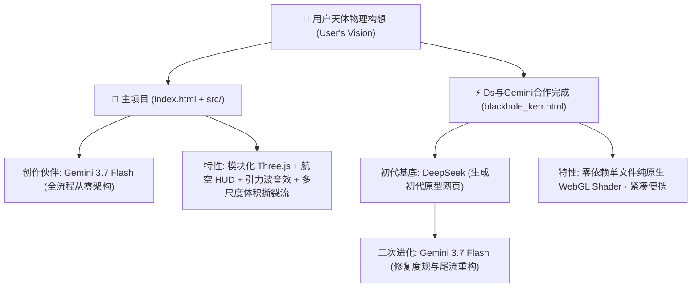

# 🌌 Kerr Relativistic Black Hole Simulation (克尔旋转黑洞天体物理模拟)

[](https://www.khronos.org/webgl/)
[](https://threejs.org/)
[](https://github.com/yhhhhdo/Gemini3.7flash-blackhole)
[](LICENSE)

<p align="center">
  

</p>
<p align="center">
  
</p>

基于 **广义相对论克尔时空度规（Kerr Metric）** 与 **全屏 GPU 光线步进（GLSL Raymarching）** 构建的交互式相对论黑洞天体物理仿真系统。

> 🌐 **在线体验网址 (Live Demo)**：
> - **主项目Gemini 3.7flash**：[https://yhhhhdo.github.io/Gemini3.7flash-blackhole/](https://yhhhhdo.github.io/Gemini3.7flash-blackhole/)
> - **Deepseek v4flash生成初版，后续由Gemini 3.7flash修改**：[https://yhhhhdo.github.io/Gemini3.7flash-blackhole/blackhole_kerr.html](https://yhhhhdo.github.io/Gemini3.7flash-blackhole/blackhole_kerr.html)

---

## 🏛️ 双版本谱系与 AI 协同创作历程 (Dual Architecture & AI Heritage)

本项目包含两个具有不同视觉风格、渲染架构与创作渊源的黑洞版本：



---

### 👑 版本 A： (`index.html` + `src/`)

* **诞生背景**：由 **用户（User）** 与 **Google Gemini 3.7 Flash** 深度协同、从零构建的模块化工业级天体仿真系统。
* **核心架构**：
  * 基于现代模块化前端工程架构（Three.js + 原生 GLSL + Web Audio API）；
  * 赛博深空航空 HUD 磨砂玻璃质感 UI，支持完全折叠与沉浸全屏模式；
  * **多尺度体积潮汐瓦解流（TDE）**：双层嵌套等离子体烟云与拉丝核心；
  * **超音速邦迪-霍伊尔引力尾流（Bondi-Hoyle Wake）** 与 **宇宙巡航漂移**；
  * **LIGO 引力波时空涟漪与真实物理啁啾声（Chirp Audio）合成引擎**；
  * **IMAX 8K 纳秒级光线步进**：自适应消除百叶窗切片走样，兼顾极致画质与 60 FPS 满帧性能。

#### 📜 核心创作提示词 (Gemini 3.7 Flash Prompt Heritage)
```text
【用户第一阶段 - 引导提问】：
创建一个黑洞，你先对我提出要求，然后我逐一回答，你再着手创作。以达到更好的效果。

【用户第二阶段 - 物理与系统规格确立】：
1. 展现形式：交互式 3D Web 网页（基于 WebGL / GLSL 光线步进，直接在浏览器打开）；
2. 视觉风格：真实天体物理 / 相对论效应风格（多普勒红蓝移、相对论喷流、非对称光环）；
3. 物理特性：克尔旋转黑洞（Kerr Black Hole），附属结构都要（吸积盘、两极喷流、星空引力透镜、伴星潮汐撕裂）；
4. 交互面板：自由相机观察、实时参数调节滑块、伴随宇宙深空氛围音效；
5. 性能与设计：我的电脑性能很好，不要在性能要求上吝啬你的作品；各个功能带有独立开关，页面保持优雅大气不臃肿。
```

---

### ⚡ 版本 B： (`blackhole_kerr.html`)

* **诞生背景**：
  * **第一阶段**：用户使用 **DeepSeek** 生成了最初的单文件 WebGL 静态着色器原型页面；
  * **第二阶段**：由 **Gemini 3.7 Flash** 进行系统性天体物理学重构与深度调试，修复了变量未定义与编译错误，补全了克尔引力透镜、双极喷流、邦迪-霍伊尔尾流与自适应光线步进积分算法。
* **核心架构**：
  * 零外部依赖、单个 HTML 包含所有 CSS、JavaScript 与 GLSL Fragment Shader；
  * 纯原生 WebGL 2.0 API 驱动，开箱即用，适合作为离线单文件演示。

#### 📜 单文件版演进提示词 (DeepSeek & Evolution Prompts)
```text
【初代原型设计 (DeepSeek)】：
生成一个单文件 HTML 的 3D 克尔黑洞着色器模拟页面，包含基础的引力透镜变形与吸积盘自转发光效果。

【后期天体物理强化 (Gemini 3.7 Flash)】：
1. 修复单文件 WebGL Shader 的编译失败与变量缺失问题；
2. 引入克尔度规 RK2 测地线偏折与爱因斯坦光子环；
3. 移植邦迪-霍伊尔激波尾流与伴星潮汐撕裂流；
4. 优化自适应步长积分，消除空间步进锯齿。
```

---

## 🌟 核心物理与天体特性 (Physical Highlights)

| 天体物理效应 | 物理学原理与实现方式 |
| :--- | :--- |
| **克尔时空光子测地线** | 自适应 Runge-Kutta (RK2) 数值微积分，精确计算强引力场下的光线偏折与时空拖拽 |
| **三重高阶光子环 ($n=1,2,3$)** | 捕捉光子在事件视界与光子球边缘回旋一圈以上形成的极细次级与三级爱因斯坦光环 |
| **Novikov-Thorne 吸积盘** | 普朗克黑体辐射色温映射，内圈超高温（$T > 38,000\text{ K}$）至外缘金红递减 |
| **多普勒聚束增亮 ($\delta^3$)** | 相对论开普勒旋转，朝向观测者一侧剧烈蓝移增亮，远离一侧红移变暗 |
| **伴星潮汐瓦解流 (TDE)** | 洛希瓣引力水滴拉丝形变，双层 3D 等离子体烟云与近心点自相交激波爆发点 |
| **邦迪-霍伊尔引力尾流** | 黑洞超音速航行时捕获星际介质形成的双曲激波锥与电离尾流 |
| **LIGO 引力波脉冲与啁啾声** | Web Audio API 振荡器与滤波网络实时合成双黑洞并合阶段频率暴增的时空引力波声学信号 |

---

## ⌨️ 快捷键指南 (Shortcuts)

| 按键 | 功能 | 说明 |
| :---: | :--- | :--- |
| <kbd>Space</kbd> | **播放 / 暂停** | 冻结或恢复黑洞时空演化与轨道运动 |
| <kbd>H</kbd> | **隐藏 / 呼出 HUD** | 切换极简沉浸式全屏观赏模式 |
| <kbd>F</kbd> | **全屏切换** | 切换浏览器无边框全屏模式 |
| <kbd>1</kbd> ~ <kbd>5</kbd> | **运镜预设切换** | 赤道平视、两极俯瞰、星际穿越、撕裂流聚焦、坠入视界 |

---

## 🚀 本地运行方式 (Local Running)

### 方式 1：VS Code Live Server（最简便）
右键 `index.html`（或 `blackhole_kerr.html`）选择 **「Open with Live Server」**。

### 方式 2：使用 Node.js / npx
```bash
npx serve .
```

### 方式 3：使用 Python
```bash
python -m http.server 8000
```
浏览器打开 `http://localhost:8000` 即可畅享！

---

## 📜 许可证 (License)

本项目采用 [MIT License](LICENSE) 开源协议。
